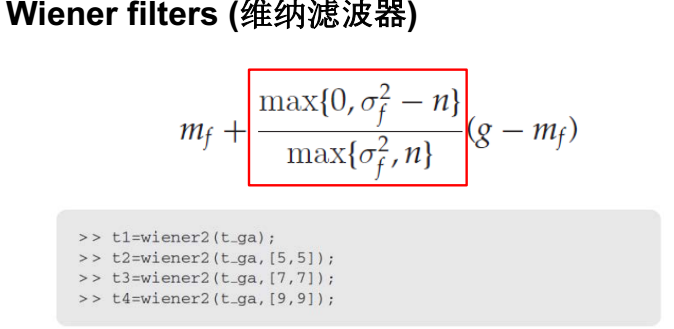
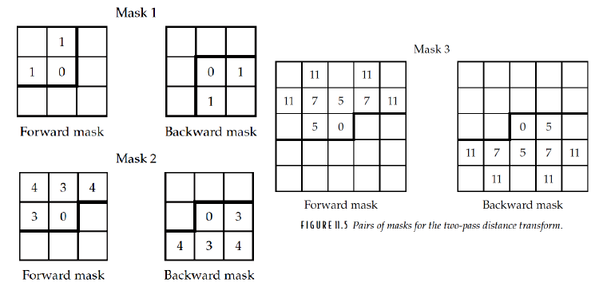

## 1 介绍

### Images and Digital Images

`xy` 表示---> `f (x, y)`(空间域上是连续的)

We may assume that in such an image, brightness values can be any real
numbers in the range 0.0 (black) to 1.0 (white)

数字图像采用pixel 表示. x,y 上是离散的像素

### 基础

一个像素周围的像素即为邻域, 但是具体多少还得看是使用的是多大的范围


### 数字图像类型

- Binary(0 & 1)
- Grayscale(0~255)
- True color or red-green-blue (RGB)(3 个0~255)
- Indexed(图像的值都是index.有一张color table,记录的是index 与RGB 值的对应关系)


> 注意图像的大小的单位, 对于二值图像而言, 使用`bits`作为基础, 而对于灰度图和彩色图像, 则使用`bytes`作为基础, 同时这里要注意, `K`表示的是1000, `M`表示的是1000,000.
>
> 注意这里使用的是大写的`K`和大写的`M`.

## 2 图像与MATLAB

```matlab
w = imread('wombats.tif')
figure, imshow(w), impixelinfo

impixel(a, 200, 100)
>>> 75 25 30

%% 索引图像, 显示的时候要使用索引图, 也就是下面的emap, 否则显示出来的是个灰度图
[em, emap] = imread('trees.tif');
figure, imshow(em, emap)

%% 用来显示图像的信息, 不可以加分号, 不然就不显示东西了
imfinfo('filename')

imwrite(w, 'filename', 'fmt');
```

## 3 图像显示

### 基础

`image` 使用高亮的64个颜色来显示图像

`colormap(map)`将当前图窗的颜色设置为map指定的颜色图


> 如果要用image 命令正确显示一张灰度图像.则应该指定对应的color map.
>
> 可通过size(unique(A)) 查看A 中有多少种不同的灰度级

`double`只改变类型, 不会改变数值

`im2double`类型, 数值都会变 将`datatype` 变成`double`,同时也把值从[0,255]映射到[0,1] 

> `double`=>`uint8 image` 可以写成两种形式: `c2=uint8(255*cd)`以及`c3=im2uint8(cd)`(`cd`为`double`)

如果要正常显示一个double 类型的数组,有两种方法:

> - 方法一: 手动归一化到[0,1]
>
>     `imshow(A / max(A(:)))`
>
> - 方法二: 自动归一化(在imshow 里加一个[])
>
>      `imshow(A,[])` ---> 会将数组的值对其范围自动归一化展示(show over the full
>
>     range)

#### 对于索引图像


### 显示图像(这里有点疑惑)

使用`imshow`显示一个矩阵, 有两种方法:

1. 将数据转化为`uint8`类型, 然后显示
2. 显示`double`的矩阵为灰度图, (元素值为0~1), 此时超出0或1则会指定为0或1. 超出1的太多的话, 会导致整体偏亮.

### 均匀量化


> grayslice(I,n) 其中I 是图像数组,n 是阈值个数
> 将灰度图像转化成使用多级阈值的索引图像(Convert grayscale image to indexed
> image using multilevel thresholding)(在imshow 的时候就需要加一个colormap)
> 例如: imshow( grayslice(I,16), gray(16) )就是用不同数量的灰度级来展示图像

### 抖动(dithering)

> 属于减少图像灰度级的一种方式
>
> 抖动在一般情况下，是指图像中的颜色数量减少的过程。
>
> 图像只用两个色调表示图像也称为半色调(halftoning)
>
> 在压缩到相同的灰度级数的条件下,dithering 的效果要好于uniform quantilization


> 抖动可以很容易地扩展到两个以上的输出灰度值例如，我们希望量化到四个输出级别0、1、2和3
>
> 这里的除法结果四舍五入即可


> **误差扩散**
>
> 图像在两个层次上被量化
>
> 对于每个像素，我们都要考虑其灰度值和量化值之间的误差
>
> 这个想法是把这个误差分散到邻近的像素上 

##  4 点处理

###  直方图

 

 

###  直方图伸展

  

> 直方图的拉伸，这里实现了把灰度级5-9拉伸到了灰度级2-14上

 

> Gamma小于1是凸，大于1是凹， 0-1转化为了c-d

  

 

> 对于范围外的像素不进行调整，这里只是调整了范围内的像素值，范围外的使用的是out的默认值

###  直方图均衡化

 

> L是灰度级总数量

 

> 这里的流程：
>
> 灰度等级及其像素统计 =》 灰度等级频度累计 =》 计算均衡后结果 =》 获得新的等级 =》**重新分配**原始的灰度等级的元素
>
> （L-1)/n=(16-1)/(15+70+110+45+80+40)=15/360=0.0417
>
> 第四列结果的计算就是$\sum n_i*0.0417$，保留两位小数就可以。比如第9级上的结果：85*0.0417=3.5417，这里上面的结果算错了么？嗯。
>
> 对于Rounded value取值，直接四舍五入即可，注意，这里的四舍五入要看**已经四舍五入后的小数点的后一位**。

## 5 邻域处理

### Mask


### Padding


> padding=0的时候，会随着反复的处理，导致每次都会长宽减小2的长度


## 6 图像几何变换

### 插值


> 插值取值与距离小于一半的临近点的值一致


> 注意这里的比例关系和对应的权重, x2虽然与x'4之间的距离的比例为2 但是其权重取值使用的是互补的比例5.


> 双线性插值的时候, 注意最外围的4个点要和插值后的图的点对齐


> 注意先插行里的点, 再插列里的点.

> 插值的存在, 是因为仿射变换之后, 不一定对应着真实的坐标, 所以要插值.
>
> 个人理解: 计算仿射变换过来的几个点包围住的真实坐标点上插值的结果.


> 用空间滤波器实现插值

## 7 傅里叶变换

### 一维傅里叶变换


### 频域滤波器

> 理想高低通, 巴特沃斯高低通, 高斯滤波器, 后两种滤波器可以用来解决**振铃**现象.
>
> 凡具有接近窗函数的滤波器，IFT之后，其空域函数形式多少接近sinc函数。sinc是进行图像滤波的主要因素，两边的余波将对图像产生振铃现象。
>
> 1阶巴特沃斯没有“振铃“，随着阶数增大，振铃现象越发明显。下图取n=2,可以看出空域函数外围部分出现震荡。
>
> 高斯函数的傅里叶变换仍然是高斯函数，故高斯型滤波器不会产生“振铃“。


## 8 图像恢复

> 对于不同噪声进行的处理: 
>
> * 椒盐噪声  
>
> * 高斯噪声 (an idealized form of white noise)
> * Speckle(斑点) Noise/Multiplicative Noise
> * Periodic Noise 


### 对于椒盐噪声

常用的空域滤波手段是 **均值滤波, 中值滤波, Rank-Oreder滤波, 异常值方法** 

> 异常值方法: 这里就是对于给定的阈值, 若是当前像素值减去周围像素的均值(一般是周围的8个)的差值, 大于阈值的话, 就设定为这个均值, 若是小于等于阈值, 就保留为原始的像素值.


### 对于高斯噪声

#### 图像平均


> 对同一样本的不同副本, 反复添加高斯噪声, 所有图片均值之后, 便是近似的原始图片.

#### 均值滤波


> 使其在小范围选择使用平均值作为像素值, 噪声均值为0, 也就自然去掉了

#### 自适应滤波

##### 最小均值平方误差滤波器


##### 维纳滤波器



### 对于周期噪声

一般使用: 带阻滤波器(band reject filtering),  陷波滤波器(notch filtering)

> 可见作业

## 9 图像分割

### 单阈值


> 现在被建议使用imbinarize()替代, 这里使用的阈值一般使用graythresh来获取.

### 阈值的应用


### 自适应滤波


### 边缘检测

边缘检测的三个标准:

1. 检测错误率低。它应该找到所有的边，除了边什么都没有。
2. 边缘定位。图像中实际边缘与该算法找到的边缘之间的距离应尽量减小。
3. 单一的响应。当只有一条边存在时，该算法不应返回多条边的像素。

---


主要是六个滤波算子:


#### Prewitt

* 

* 

* 

    > 注意这里, 两个滤波器都是作用于原始图像, 得到最终的结果后应该计算平方和的开方

    

#### Roberts

* 

#### Sobel

* 

    > Sobel滤波器相对于Prewitt滤波器, 对中心像素的突出程度略高

* 在这三个过滤器中，Sobel过滤器可能是最好的;它们提供了良好的边缘，在有噪声的情况下也能相当好地形成

#### Laplace

* 

* 各向同性滤波器, 旋转不变量

* 二阶导数滤波器, 对噪声非常敏感

* 改出一个双边界

* 

* 拉普拉斯算子的一个更合适的用途是通过定位零交叉点来找到边缘的位置.

    

    > 基于事实:
    >
    > 1. 边缘的位置是由滤波器的值取零的地方给出的。
    > 2. 过滤器结果改变符号的位置
    >
    > 定义zero crossings为以下两种:
    >
    > 1. 灰度值为负, 并且与灰度值为整的像素正交相邻
    >
    > 2. 灰度值为0, 并且在正负灰度值之间

#### log

> 
>
> 

#### Canny ?(与yanbin的有点不同)

* 

## 10 数学形态学

形态学是图像处理的一个分支，对于分析图像的形状特别有用

### 基本想法

#### Translation


#### Reflection


### 膨胀腐蚀

#### 膨胀(Dilation)

* 

    > 这里是闵可夫斯基加法, 加法支持交换律.

* 可以增加目标的大小

* 

    > 将结构B在结构A上进行卷积操作，如果移动结构B的过程中，**与结构A存在有效重叠区域**，则记录该位置，所有移动结构B与结构A存在交集的位置的集合为结构A在结构B作用下的膨胀结果。 

#### 腐蚀(Eroll)

* 

* 两种结构: 

    * 全为包含的腐蚀:

        

        > 移动结构B，如果结构B与结构A的**交集完全属于结构A的区域内**，则保存该位置点，所有满足条件的点构成结构A被结构B腐蚀的结果。

    * 存在非包含的结构:

        

        > 在前面的基础上在B上又限制了几个不要求包含的点

#### 膨胀腐蚀的关系


#### 应用 边界检测


* 
* 

### 开闭操作

#### 开操作(opening)


> 先进性腐蚀, 在进行一次膨胀
>
> - 注意, 开操作后, 结果是A的子集, 腐蚀就不一定.
> - 连续两次开操作结果仍然一致. 开闭操作只有一次有效.
> - A对于C的子集关系, 仍然存在于他们经过同一个核的开操作结果之间.
> - 开口往往会**使图像平滑**，**打破狭窄的连接**，并**消除薄的突出物**

#### 闭操作(closing)


> 先执行膨胀, 再执行腐蚀操作
>
> * A是闭操作结果的子集
> * 连续两次闭操作等价于一次的效果
> * A与C的子集关系, 仍然存在于他们经过同一个核的闭操作结果之间.
> * 闭操作趋向于平滑图像, 但是会融合狭窄的连接, 和细的沟壑，消除了小洞

#### 应用 噪声移除


> **形态学滤波** 先开操作, 再闭操作

#### 开闭操作的关系


> 有点类似与膨胀腐蚀间的关系, 应该是可以拿膨胀腐蚀来证明的.

### Hit-or-Miss转换


> 具体的操作就是先执行两次腐蚀操作, 在执行一次交集计算.


### 区域填充


> 迭代执行膨胀交集操作, 以此得到, 直到最后不能再移动了为止(只能从边界**内部开始,** 进行**连续的移动**, 不能跨出去).
>
> 
>
> 最后相当于把原本的A的内部的数据给弄了出来


### 骨化操作


> 也就是先腐蚀, 再开操作(也就是腐蚀->膨胀), 再取与原图的差异 
>
> 直到最后, 开操作的结果变成空集的时候, 就是最后一个了, 再往后就不再继续了. 因为再往后的结果也应该是空集了.


## 11 图像拓扑

我们通常只对图像最基本的方面感兴趣: 

* 一个特定物体的出现次数
* 无论是否存在. 

研究图像的这些基本性质称为数字拓扑或图像拓扑

### 邻域与邻接

#### 邻接

在特定条件下, 一个像素可以被认为紧挨着另一个像素. 这里因为只探讨二值图像, 所以只考虑像素位置, 4邻域与8邻域.


#### 4连接组件

研究区域的内部的点之间满足4邻域关系, 也就是上下的或者是左右的连接关系, 就可以认为是4连接组件.

#### 8连接组件

类似于上面的, 这里只是以八连接关系作为依据. 多了对角线的关系.

### 组件标记

> 这个操作可以用来统计图像中的目标数量, 主要的指令是`bwlabel()`


> 步骤1. 我们开始沿着第一行移动。第一个前景像素的**上邻和左邻要么是背景像素，要么是不存在的**，所以我们给它赋值加1, 因为它是第一个, 所以标记为1, 而对于右图的, 标记为2(因为加了两次1). 以此得到
>
> 
>
> 可以这样理解, 讲前面的给定的3x3矩阵的p位置, 在4x4的矩阵上进行滑动, 当对应的三个位置上没有被标记过的点时, 就对p处对应的点赋新值(1,2,3...依次递增), 若是这三个位置上有被标记过的点的时候, 就可以选择使用位于上方的u处的值来作为p处的新值, 也就相当于是认为是连接的.


### 距离与指标

当距离函数满足下面的条件时, 可以被称为度量指标:


> 注意这里的坐标,`p=(y1, y2)`,`q=(x1,x2)`. 棋盘距离是只保留对角线和边缘距离

#### 距离标记

计算从一个点往周围若干方向走所需要付出的(距离)代价

方法一:

通过迭代的方式,计算图上每一个点对应的最短距离. (一次只解决一部分点的最短距离就可
以了,迭代几轮就可以知道图中每个点的最短距离)


> 这里是为了获得距离目标区域R的距离. 先对R区域内的设定为0, 外面的初始设定为无穷.
>
> 遍历像素, 使用2中的规则更新周围的像素标记值.


> 这里给了 三个 不同的掩膜, 后两个还需要计算除法.

方法二:

一个更快的方法, 传播两次就可以. 第一次, 从图像的左上角开始, 从左往右移动, 从上往下移动. 第二次, 从右下角开始移动, 从右往左移动, 从右往左移动, 从下往上移动.



#### MATLAB实现


### 形态学骨化


> 这里的一二行结尾是逗号
>
> 这里的统计的数量是4连接部件和8连接部件的数量. 所以杜宇图11.15而言, 这里的A是2, C是1.

#### Zhang-Suen骨化算法


> 我们通过检查以该像素为中心的3x3 邻域,来判断该像素是否”可删除”.
>
> 这里的N的一个单位表示沿着目标周围一轮处理. 从1开始.
>
> 这里只有同时满足三个条件的时候, 才会标记为"可删除"
>
> - 第一个条件中的B表示对应于mask的p的位置的周围8个像素中的前景像素数量
> - 第二个条件中的X表示对于掩膜中的位置p1~p8结果组成的一个连续序列中, 出现"01"的次数.(这里是要从左上角开始么?若是p1=1, p8=0呢?)
> - 第三个条件依据对应的N来确定给定位置上的乘积需要满足的要求.
>
> 每一轮后标记为可删除的, 就删掉. 下一轮还是从最上面的一行的最左面的位置开始扫描.


##### Guo-Hall骨化算法与Zhang-Suen算法之间的差异

1. 每一步里会删除更多的像素, 因此将会工作的更快.
2. 最终的结果闭Zhang-Suen算法包含更多的角点信息.

## 12 形状与边界

### 链码(chain code)


> 逆时针方向移动的话, 可以得到如上的链码结果.
>
> 沿着边界, 把移动的方向标记出来, 顺序收集起来就是链码.

#### 链码归一化

> 1. 链码依赖于起始像素
> 2. 链码依赖于目标方向
>
> 

链码的归一化就是对所有可能的链码进行列举, 选择最后整体处于升序的, 从0开始的链码(前面的0最多的)的那个, 作为归一化的结果.

## 13 颜色处理


> 显示器:三原色光(RGB)
>
> 图像处理:HSV, HSI, YC,C
>
> 打印机:颜料原色(CMY)

### HSV模型


### YIQ模型


### YCbCr模型


### 综合实例


 

